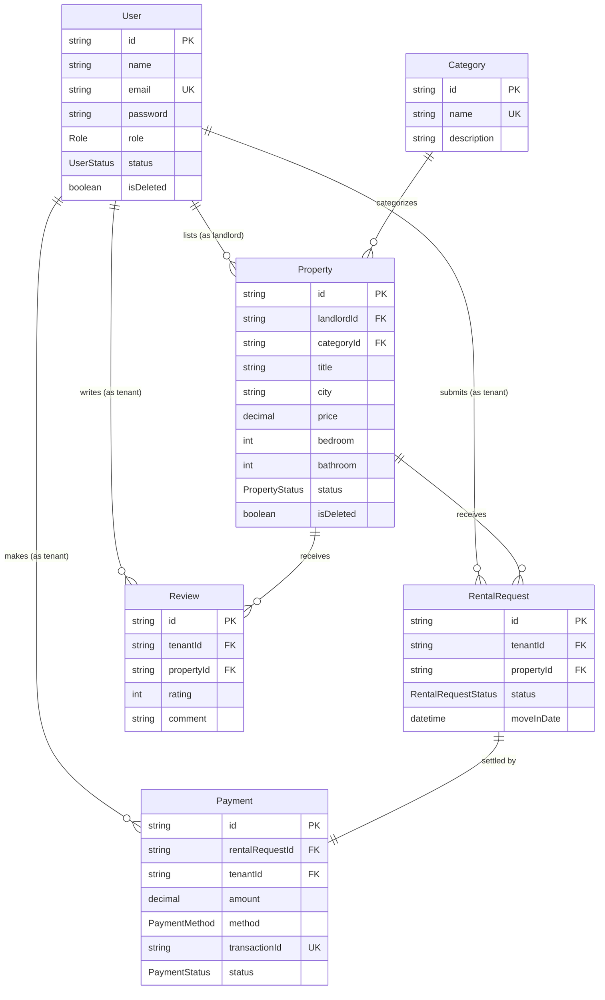

# 🏠 RentNest — Rental Property Marketplace API

RentNest is a role-based backend API for a rental property marketplace. **Landlords** list and manage properties, **Tenants** browse listings, submit rental requests and pay rent online, and **Admins** oversee the platform.

Built for **Apollo Level 2 Web Dev — Assignment 4 (B7A4)**.

---

## 📋 Table of Contents

- [Overview](#-overview)
- [Tech Stack](#️-tech-stack)
- [Roles & Permissions](#-roles--permissions)
- [Project Structure](#-project-structure)
- [Database Schema (ERD)](#️-database-schema-erd)
- [Getting Started](#-getting-started)
- [Environment Variables](#-environment-variables)
- [API Endpoints](#-api-endpoints)
- [Error Response Format](#-error-response-format)
- [Payment Flow (Stripe)](#-payment-flow-stripe)
- [Known Limitations](#-known-limitations)

---

## 🔍 Overview

RentNest lets landlords list rental properties, tenants request to rent them, and — once a landlord approves a request — tenants pay securely through **Stripe Checkout**. The platform tracks the full lifecycle of a rental: browsing → requesting → approval → payment → review.

---

## 🛠️ Tech Stack

| Layer          | Technology                                   |
| -------------- | --------------------------------------------- |
| Runtime        | Node.js                                       |
| Language       | TypeScript                                    |
| Framework      | Express.js (v5)                               |
| Database       | PostgreSQL                                    |
| ORM            | Prisma ORM (v7, multi-file schema)            |
| Auth           | JWT (access + refresh tokens), bcryptjs       |
| Validation     | Yup                                           |
| Payments       | Stripe Checkout + Webhooks                    |
| Dev Tools      | tsx (dev server), tsc (build)                 |

---

## 👥 Roles & Permissions

| Role         | Description                          | Key Permissions                                                      |
| ------------ | ------------------------------------- | ---------------------------------------------------------------------- |
| **Tenant**   | Users looking for rental properties   | Browse listings, submit rental requests, pay rent, leave reviews       |
| **Landlord** | Property owners who list rentals      | Create/manage listings, approve/reject requests, view request history |
| **Admin**    | Platform moderators                   | Manage categories, moderate properties, oversee the platform          |

> Users select `TENANT` or `LANDLORD` during registration. The `ADMIN` role cannot be self-registered — see [Known Limitations](#-known-limitations) for how to provision one.

---

## 📁 Project Structure

```
src/
├── app.ts                     # Express app & route mounting
├── server.ts                  # Server bootstrap
├── config/                    # Environment variable loader
├── lib/
│   ├── prisma.ts               # Prisma client (pg adapter)
│   └── stripe.ts               # Stripe client
├── middleware/
│   ├── auth.ts                  # JWT verification + role guard
│   ├── validateRequest.ts       # Yup schema validator
│   ├── globalError.ts           # Centralized error handler
│   └── not-found.ts             # 404 handler
└── modules/
    ├── auth/                    # Login
    ├── user/                    # Register, profile
    ├── category/                # Property categories (CRUD)
    ├── property/                 # Property listings (CRUD, search & filter)
    ├── landlord/                 # Landlord-specific request management
    ├── rentalRequest/            # Tenant rental requests
    ├── payment/                  # Stripe checkout, webhook, payment history
    ├── review/                   # Tenant reviews
    └── utils/                    # catchAsync, sendResponse, jwt, pick

prisma/
├── schema/                   # Multi-file Prisma schema (user, property, category,
│                                rentalRequest, payment, review, enums)
└── migrations/                # SQL migration history
```

---

## 🗺️ Database Schema (ERD)

Full interactive ERD: **[drawSQL — RentNest](https://drawsql.app/teams/tahazzee/diagrams/rent-nest)**



---

## 🚀 Getting Started

### 1. Clone & install

```bash
git clone <your-repo-url>
cd rentnest
npm install
```

### 2. Configure environment

Copy `.env.example` to `.env` and fill in your own values (see [Environment Variables](#-environment-variables)).

```bash
cp .env.example .env
```

### 3. Run database migrations

```bash
npx prisma migrate dev
```

### 4. Start the dev server

```bash
npm run dev
```

The API runs at `http://localhost:5000` by default (see `PORT` in `.env`).

### 5. Build for production

```bash
npm run build
node dist/server.js
```

---

## 🔐 Environment Variables

| Variable                 | Description                                         |
| ------------------------- | ---------------------------------------------------- |
| `PORT`                    | Port the server listens on                           |
| `APP_URL`                 | Frontend/client URL (used for CORS + Stripe redirects) |
| `DATABASE_URL`            | PostgreSQL connection string                          |
| `BCRYPT_SALT_ROUNDS`      | Salt rounds for password hashing                      |
| `JWT_ACCESS_SECRET`       | Secret for signing access tokens                      |
| `JWT_ACCESS_EXPIRES_IN`   | Access token lifetime (e.g. `1d`)                     |
| `JWT_REFRESH_SECRET`      | Secret for signing refresh tokens                     |
| `JWT_REFRESH_EXPIRES_IN`  | Refresh token lifetime (e.g. `7d`)                    |
| `STRIPE_SECRET_KEY`       | Stripe secret API key                                 |
| `STRIPE_PRICE_ID`         | (Optional) pre-defined Stripe price ID                |
| `STRIPE_WEBHOOK_SECRET`   | Secret used to verify Stripe webhook signatures       |

> ⚠️ Never commit real secrets. Rotate any key that has ever been shared or pushed to a public repository.

---

## 📡 API Endpoints

### Auth & Users

| Method | Endpoint             | Access        | Description                    |
| ------ | --------------------- | ------------- | -------------------------------- |
| POST   | `/api/users/register`  | Public        | Register as tenant or landlord   |
| GET    | `/api/users/me`        | Authenticated | Get logged-in user's profile     |
| POST   | `/api/auth/login`      | Public        | Login, returns access & refresh tokens |

### Categories

| Method | Endpoint               | Access | Description             |
| ------ | ------------------------ | ------ | -------------------------- |
| GET    | `/api/categories`         | Public | List all categories        |
| GET    | `/api/categories/:id`     | Public | Get a single category      |
| POST   | `/api/categories`         | Admin  | Create a category           |
| PATCH  | `/api/categories/:id`     | Admin  | Update a category           |
| DELETE | `/api/categories/:id`     | Admin  | Delete a category           |

### Properties

| Method | Endpoint               | Access           | Description                                  |
| ------ | ------------------------ | ---------------- | ----------------------------------------------- |
| GET    | `/api/properties`         | Public           | List properties (search, filter, pagination)    |
| GET    | `/api/properties/:id`     | Public           | Get property details                            |
| POST   | `/api/properties`         | Landlord         | Create a property listing                       |
| PATCH  | `/api/properties/:id`     | Landlord / Admin | Update a property listing                       |
| DELETE | `/api/properties/:id`     | Landlord / Admin | Delete (soft-delete) a property listing         |

`GET /api/properties` supports query params: `searchTerm`, `city`, `minPrice`, `maxPrice`, `bedroom`, `bathroom`, `categoryId`, `status`, `page`, `limit`, `sortBy`, `sortOrder`.

### Rental Requests

| Method | Endpoint            | Access                     | Description                          |
| ------ | --------------------- | -------------------------- | ---------------------------------------- |
| POST   | `/api/rentals`         | Tenant                     | Submit a rental request for a property   |
| GET    | `/api/rentals`         | Tenant                     | Get my rental requests                    |
| GET    | `/api/rentals/:id`     | Tenant / Landlord / Admin  | Get a single rental request (ownership checked) |

### Landlord

| Method | Endpoint                      | Access   | Description                                  |
| ------ | -------------------------------- | -------- | ----------------------------------------------- |
| GET    | `/api/landlord/request`           | Landlord | Get all rental requests for my properties       |
| POST   | `/api/landlord/request/:id`       | Landlord | Approve or reject a rental request              |

### Payments (Stripe)

| Method | Endpoint                    | Access                    | Description                                 |
| ------ | ------------------------------ | ------------------------- | ----------------------------------------------- |
| POST   | `/api/payments/create`          | Tenant                    | Create a Stripe Checkout session for an approved request |
| POST   | `/api/payments/confirm`         | Tenant                    | Manually verify a payment by session ID (fallback) |
| POST   | `/api/payments/webhook`         | Stripe (server-to-server) | Stripe webhook — auto-confirms payment status |
| GET    | `/api/payments`                 | Tenant                    | Get my payment history                          |
| GET    | `/api/payments/:id`             | Tenant / Landlord / Admin | Get a single payment (ownership checked)        |

### Reviews

| Method | Endpoint         | Access | Description                                  |
| ------ | ------------------ | ------ | ----------------------------------------------- |
| POST   | `/api/reviews`       | Tenant | Leave a review (only after an approved rental)  |

---

## ⚠️ Error Response Format

All errors return a consistent JSON shape from the global error handler, with special handling for Yup validation errors and known Prisma error codes (`P2002` duplicate, `P2025` not found, `P2003` FK violation, etc.):

```json
{
  "success": false,
  "statusCode": 400,
  "errorCode": "P2002",
  "name": "PrismaClientKnownRequestError",
  "message": "Duplicate value for field: email",
  "errorMessages": [
    { "path": "email", "message": "Duplicate value for field: email" }
  ]
}
```

Successful responses follow this shape:

```json
{
  "success": true,
  "statusCode": 200,
  "message": "Properties retrieved successfully",
  "data": { }
}
```

---

## 💳 Payment Flow (Stripe)

1. Tenant submits a rental request → `POST /api/rentals`.
2. Landlord approves it → `POST /api/landlord/request/:id`.
3. Tenant creates a Stripe Checkout session → `POST /api/payments/create`. A `Payment` row is created with status `PENDING`.
4. Tenant completes payment on the Stripe-hosted checkout page.
5. Stripe confirms the payment one of two ways:
   - **Webhook** (`POST /api/payments/webhook`) — Stripe calls this automatically; the signature is verified and the payment is marked `PAID`.
   - **Manual confirm** (`POST /api/payments/confirm`) — a fallback for local development where Stripe can't reach your webhook URL (e.g. via the Stripe CLI or `ngrok`).

---

## 📝 Known Limitations

This section is intentionally kept so any future contributor knows what's left:

- **Admin provisioning**: registration currently blocks creating an `ADMIN` user via the API. To get a working admin account, either seed one directly in the database (`role = 'ADMIN'`) or temporarily relax that check — a proper `prisma/seed.ts` script is recommended.
- **Dedicated admin endpoints** (list/ban users, platform-wide property & rental overviews) are not yet implemented as a separate module — admin authorization currently only gates property/category management.
- **API documentation** (Postman collection / Swagger) is maintained separately — see the link shared with this submission.

---

## 👩‍💻 Author

**Umme Tahazzee** — Apollo Level 2 Web Dev, Assignment B7A4
GitHub: [@umme-Tahazzee](https://github.com/umme-Tahazzee)